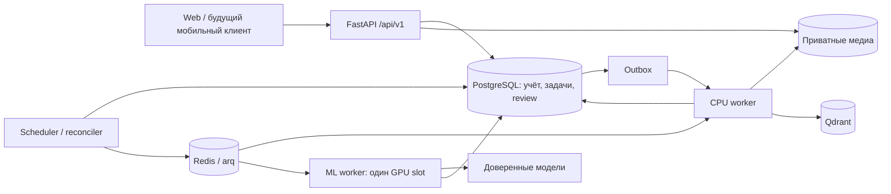

# Инвентаризатор

Личный учёт вещей: что есть, где находится, сколько осталось и когда истекает срок. Пользователь вводит текст, фотографирует или записывает голос. AI готовит предложение; **учёт меняется только после явного подтверждения**. Ручные операции проходят тот же сервис команд. PostgreSQL хранит подтверждённые данные и историю, поэтому повтор HTTP-запроса, перезапуск worker или потеря Redis не должны повторять расход или терять очередь проверки.

Документация актуализирована после рефакторинга frontend **23–24 сентября 2026 года**, API `v1`. README — вход в проект и каталог поставляемых файлов. Фактические контракты и эксплуатация собраны в DOCS.md; требования к интерфейсу, состояние реализации и оставшаяся приёмка — в FRONTEND_SPEC.md и отчёте frontend.

## Навигация

| Документ | Что в нём искать |
|---|---|
| [DOCS.md](DOCS.md) | Архитектура, предметные правила, состояния, примеры запросов, все HTTP-операции, настройки, модель БД, эксплуатация и ограничения |
| [ТЗ фронтенда](docs/FRONTEND_SPEC.md) | Все экраны, формы, компоненты, состояния, медиа, polling, доступность, критерии приёмки и необходимые расширения API |
| [Текущий frontend](frontend/README.md) | Запуск, dev proxy, сборка, обновление контейнера и назначение файлов интерфейса |
| [Отчёт frontend](docs/EPIC_FRONTEND_REFACTOR.md) | Результаты FE-0…FE-7, проведённые проверки и незакрытые ограничения |
| [AGENT.md](AGENT.md) | Исходное подробное ТЗ бэкенда; желаемое поведение не всегда означает наличие реализации |
| [Отчёт о рефакторинге](docs/REFACTOR_REPORT.md) | Результат каждого эпика, проведённые проверки и оставшиеся границы |
| [Матрица приёмки](docs/ACCEPTANCE.md) | Сценарии T-01…T-80 и точные ссылки на проверки |
| [Runbook](docs/RUNBOOK.md) | Установка, модели, восстановление очереди, backup/restore и обновление |
| [Контракт медиа и прогресса](docs/API_MEDIA_PROGRESS.md) | Миниатюры, подготовка файлов, стадии, пары и одиночные штуки |
| [Сверка документации](docs/EPIC_DOCUMENTATION.md) | Сопоставление всех разделов AGENT.md и отчётов с текущим кодом; выявленные расхождения |
| OpenAPI и JSON Schema | Генерируются командой `uv run python -m app.cli schemas`; в репозиторий не включаются как служебные артефакты |

При расхождении документации с сервером сначала проверяйте фактическую схему и обработчик. Неполные response-схемы OpenAPI дополняются описаниями в DOCS.md. ТЗ фронтенда явно отделяет существующие API от предложенных расширений. Старый BRD из корневого `docs.md` сохранён локально в `data/docs-before-documentation-20260921.md`; он не является действующим контрактом.

## Возможности и границы

- Карточка вещи с миниатюрой (photo preview), партии и уникальные экземпляры; дерево мест и контейнеров с поддержкой drag-and-drop.
- Статусы активных и архивных вещей в каталоге; отдельный блок предложений на проверке. Неподтверждённое предложение не становится карточкой или остатком.
- Поступление, расход, полный и частичный перенос, корректировка, разделение и объединение партий, архив, восстановление и отмена операций.
- Точные, приблизительные и неизвестные количества; учёт присутствия; Decimal без float; совместимые единицы. Пара = две штуки, одиночная штука допустима.
- Фото, голос, текст и сохраняемая очередь проверки; объединение предложений для общей проверки и независимые пакетные подтверждения. Многошаговая групповая загрузка отдельных наборов материалов в текущем web ещё не реализована. Ошибка модели оставляет возможность ручной работы.
- Приватные фотографии, нормализованные копии и миниатюры в каталоге/поиске; один ограниченный коллаж для inference.
- Гибридный поиск: подтверждённые имена/псевдонимы/коды, PostgreSQL FTS, BGE-M3, sparse BM25 и RRF.
- Сроки продуктов, документов и лекарств; уведомления внутри приложения. Графики приёма лекарств отсутствуют.
- Версионированные настройки, диагностика стадий, управление очередями, экспорт, контролируемое удаление и резервные копии.

Документы и `local_only` данные не передаются внешним AI. Доверенный сервер владельца может находиться на другой машине: «локально» обозначает контур доверия. Cloud выключен по умолчанию. Ключи моделей никогда не нужны фронтенду.

Автоматические detail-pass по фрагментам фото, пороги confidence, дополнительная цепочка fallback, отдельный dataset writer, кэш списков, raw-payload диагностика и push не поставляются. Текущий React-клиент переработан: каталог, ручной учёт, дерево мест, review, медиа, задачи, настройки и администрирование используют единый клиент API. Полная приёмка ТЗ ещё не закрыта: остаются ограничения API, браузерная и Android-проверка, описанные в [отчёте](docs/EPIC_FRONTEND_REFACTOR.md). Проверенная работа нескольких кейсов не является оценкой точности всего набора фотографий и голоса.

## Архитектура



`app/domain` задаёт схемы и правила; `app/application` связывает их в сценарии; `app/api` реализует HTTP; `app/infrastructure` содержит адаптеры; `app/workers` выполняет фоновые задания. Предметные изменения атомарны внутри workspace. Долгие вызовы моделей выполняются без открытой транзакции БД. Ожидание пользователя не занимает GPU.

## Окружение

| Компонент | Профиль проекта |
|---|---|
| Python | 3.12+, контейнер Python 3.12 |
| Python-зависимости | `uv.lock`; `uv sync --frozen`; Docker/CI используют uv 0.12.15 |
| Backend | FastAPI, Pydantic 2, SQLAlchemy 2, Alembic, arq |
| База / очередь | PostgreSQL 16 / Redis 7 |
| Поиск / медиа | Qdrant 1.18.0 / MinIO; приватный бакет |
| Базовый web | React 19, Vite 8, Node.js 22 в CI, npm lock |
| Локальные модели | Ollama `gemma3:4b`, `bge-m3:latest` |
| Аудио | Доверенный endpoint с проверенным WAV `input_audio`, например настроенный владельцем Gemma E4B |

Версии библиотек берутся из lock-файлов; не заменяйте установку из lock на произвольное обновление всех пакетов. Для ручного учёта модели не обязательны, но для фоновых подтверждений нужны CPU worker и scheduler.

## Быстрый запуск для разработки

Команды выполняются из корня репозитория. Основной Compose использует отдельные named volumes; перед первым запуском задайте собственные секреты в `.env.local`.

```powershell
uv sync --frozen
if (-not (Test-Path .env.local)) { Copy-Item .env.example .env.local }
docker compose --env-file .env.local up -d postgres redis qdrant minio
```

Отредактируйте `.env.local`: задайте случайные `POSTGRES_PASSWORD`, `MINIO_PASSWORD` и `INV_JWT_SECRET` минимум из 32 символов. Основной Compose передаст сервисам внутренние адреса автоматически.

```dotenv
POSTGRES_PASSWORD=replace-with-a-long-random-password
MINIO_PASSWORD=replace-with-another-long-random-password
INV_JWT_SECRET=replace-with-at-least-32-random-characters
INV_COOKIE_SECURE=false
INV_CORS_ORIGINS=["http://localhost:5173","http://127.0.0.1:5173"]
```

```powershell
uv run alembic upgrade head
uv run python -m app.cli bootstrap --login owner --storage
uv run uvicorn app.main:app --host 127.0.0.1 --port 8000
```

Bootstrap выполняется один раз в пустой схеме и запрашивает пароль длиной не менее 12 символов. Создаются владелец, workspace и системное место. При повторном запуске уже инициализированной БД пропустите bootstrap. Открытой регистрации нет; сброс пароля — `uv run python -m app.cli reset-password --login owner`.

Каждый worker запускается в отдельном терминале:

```powershell
uv run python -m app.cli worker cpu
uv run python -m app.cli worker ml
uv run python -m app.cli worker scheduler
```

Web — ещё один терминал:

```powershell
cd frontend
npm.cmd ci
$env:INVENTORY_API_URL = 'http://127.0.0.1:8000'
$env:INVENTORY_API_ORIGIN = 'http://localhost:5173'
npm.cmd run dev
```

Откройте адрес Vite: по умолчанию `http://localhost:5173`. В примере выше proxy направлен на API 8000 с разрешённым Origin 5173. Без переменных dev использует уже запущенный проверочный стек: API 58000 и Origin 18080. Подробности запуска и описание файлов — в [frontend/README.md](frontend/README.md). Для HTTPS нужны `INV_COOKIE_SECURE=true` и разрешённый Origin.

## Контейнерная установка и ресурсы

Основной [docker-compose.yml](docker-compose.yml) использует постоянные named volumes. Для него задайте собственные `POSTGRES_PASSWORD`, `MINIO_PASSWORD`, `INV_JWT_SECRET`, `INV_CORS_ORIGINS` и параметры моделей в `.env.local`.

```powershell
docker compose --env-file .env.local build
docker compose --env-file .env.local up -d postgres redis qdrant minio
docker compose --env-file .env.local run --rm api alembic upgrade head
docker compose --env-file .env.local run --rm api python -m app.cli bootstrap --login owner --storage
docker compose --env-file .env.local up -d --force-recreate api cpu ml scheduler web
```

Web публикуется на loopback 8080, API — на 8000. Внешний HTTPS reverse proxy настраивается отдельно; разрешённый Origin должен соответствовать адресу браузера. Базы и MinIO основного профиля не публикуют порты на хост. `cloud` запускается только явным профилем после настройки и разрешения внешних моделей. Обновление API сопровождается пересозданием web nginx, чтобы он заново разрешил адрес контейнера.

| Профиль | Порты на хосте | Назначение |
|---|---|---|
| Основной | API 8000, web 8080 | Постоянная установка с named volumes |
| Тестовые Compose-профили | В этот публичный коммит не включены | Тесты и smoke-инфраструктура остаются локальными |

Основной профиль без cloud имеет суммарные лимиты контейнеров 1600 MiB. **Модели Ollama/llama.cpp в эту сумму не входят.** Inference по умолчанию ограничен 512 px и 256 KiB. CPU-подготовка двух параллельных групп фото 4032×3024 измерена в 190,83 MiB RSS при лимите 256 MiB; это результат конкретного теста, не лимит памяти любой модели.

`docker compose stop` сохраняет named volumes основного профиля. `docker compose down -v` удаляет данные и не является командой обновления рабочего приложения. Тестовые Compose-файлы, пробы и кейсы в публичную поставку не включены.

## Проверки и генерация контрактов

```powershell
uv run pytest -q
uv run ruff check app tests scripts migrations
uv run ruff format --check app tests scripts migrations
uv run mypy
uv run python -m app.cli verify-prompts
uv run python -m app.cli schemas
uv run alembic check
```

Mypy проверяет `app/domain` и `app/settings`, а не весь backend. Обычный pytest использует SQLite и пропускает проверки, для которых не включены внешние сервисы. Полный прогон с PostgreSQL, реальной потерей тестового Redis и backup/restore описан в [DOCS.md](DOCS.md#testing). Последний такой прогон: **186 passed за 166,38 секунды**. Документационные изменения не означают нового прогона сервисов.

```powershell
cd frontend
npm test
npm run lint
npm run build
```

Vitest запускает `src/**/*.test.{js,jsx}` одним worker: текущие компоненты и исторические v1 проверки. Тесты являются локальными материалами и исключены из Git по требованию владельца. Модельные smoke требуют отдельных тестовых сервисов. Результаты текущего frontend-рефакторинга и непроверенные сценарии — в [отчёте](docs/EPIC_FRONTEND_REFACTOR.md).

## Полное дерево и назначение каждого файла

Ниже перечислены **все поставляемые файлы проекта**, включая тестовые кейсы, схемы, инфраструктуру и web-клиент. Описание справа относится к конкретному файлу. `node_modules`, виртуальные окружения, содержимое `.git`, кэши, секреты, рабочие медиа и локальные архивы не являются исходниками поставки: их назначение описано после дерева. Имена файлов с пробелами и кириллицей сохранены без сокращений.

<!-- PROJECT_TREE_START -->
```text
inventory/
├── .github/
│   └── workflows/
│       └── check.yml — CI: миграции, Python-проверки, схемы/промпты и сборка web.
├── app/
│   ├── api/
│   │   ├── __init__.py — Маркер Python-пакета app/api.
│   │   ├── admin.py — HTTP настроек, моделей, очередей/GPU, trace/replay, jobs, GC, audit и health.
│   │   ├── auth.py — HTTP входа/refresh/logout, cookie/Origin, профиля и соглашений.
│   │   ├── catalog.py — HTTP каталога, команд/форм, review/confirm/batches, мест и истории.
│   │   ├── deps.py — Общие auth/workspace/admin/write dependencies и idempotency header.
│   │   ├── maintenance.py — HTTP экспорта, deletion preview, purge и отмены очистки.
│   │   ├── media.py — Multipart upload, авторизованное чтение медиа и deletion preview.
│   │   ├── notifications.py — HTTP inbox, snooze и CRUD правил сроков.
│   │   ├── search.py — HTTP поиска с query, фильтрами и cursor.
│   │   └── tasks.py — HTTP задач, batch polling, retry/cancel/manual-review и ingestion batches.
│   ├── application/
│   │   ├── __init__.py — Маркер Python-пакета app/application.
│   │   ├── auth.py — Пароли, сессии/JWT/refresh family, bootstrap и соглашение доверия.
│   │   ├── extraction.py — Проверка и нормализация недоверенных результатов модели в предложения.
│   │   ├── idempotency.py — Hash запросов и сохранение/воспроизведение идемпотентных ответов.
│   │   ├── inventory.py — Общий интерпретатор 18 команд: preview, версии, apply, история и reverse.
│   │   ├── maintenance.py — Экспорты, deletion manifests, shared media, GC, retention и purge.
│   │   ├── notifications.py — Планирование сроков, поколения occurrences, quiet hours и in-app доставка.
│   │   ├── photos.py — Пакетная сборка доступных photo/thumbnail ссылок для карточек и поиска.
│   │   ├── proposals.py — Review-формы, типизированные правки, конфликты, batches и confirmations.
│   │   ├── search.py — Кандидаты/поиск, SQL hydration, фильтры и страничная выдача.
│   │   ├── settings.py — Effective snapshots, validation/impact, revisions, restart acknowledgements и rollback.
│   │   └── tasks.py — Создание durable задач, admission limits, task view и ручное продолжение.
│   ├── db/
│   │   ├── __init__.py — Маркер Python-пакета app/db.
│   │   ├── models.py — 36 ORM-таблиц, типы, ограничения, FK и индексы схемы inventory.
│   │   └── session.py — Async engine/session, сериализация записей и scoped lookup.
│   ├── domain/
│   │   ├── __init__.py — Маркер Python-пакета app/domain.
│   │   ├── common.py — UUID, UTC, Decimal и каноническая сериализация/hash.
│   │   ├── contracts.py — Версионированные контракты extraction, review, collage и export.
│   │   ├── errors.py — DomainError и единая проверка require с кодом/деталями.
│   │   ├── reference.py — Категории/атрибуты, единицы, их подписи и допустимые преобразования.
│   │   ├── rules.py — Чистые правила количеств, сроков, дерева, privacy и переходов task.
│   │   └── schemas.py — Строгие Pydantic-схемы всех предметных команд.
│   ├── infrastructure/
│   │   ├── __init__.py — Маркер Python-пакета app/infrastructure.
│   │   ├── audio.py — WAV PCM16, mono/16 kHz, сегменты/overlap и соединение транскрипта.
│   │   ├── backup.py — Согласованный pg_dump, manifest/hash, безопасный restore и deletion ledger.
│   │   ├── gpu.py — Единственный durable GPU slot, heartbeat, fencing и quarantine.
│   │   ├── logging.py — Структурированные логи с разрешёнными техническими полями.
│   │   ├── media.py — Валидация/нормализация фото, EXIF, thumbnails, JPEG budgets и collage manifest.
│   │   ├── models.py — Ollama/доверенный audio/внешний адаптеры, guards, prompts и ошибки providers.
│   │   ├── search.py — BGE dense, sparse BM25, Qdrant RRF, версии индекса и alias.
│   │   └── storage.py — Приватное S3/локальное хранение объектов через общий адаптер.
│   ├── settings/
│   │   ├── __init__.py — Маркер Python-пакета app/settings.
│   │   └── registry.py — Реестр 67 admin/4 user настроек, defaults, ограничения и schema UI.
│   ├── workers/
│   │   ├── __init__.py — Маркер Python-пакета app/workers.
│   │   ├── pipeline.py — Подготовка и модельные стадии, retries/cooldown, budgets и durable checkpoints.
│   │   └── queue.py — arq workers, dispatch/reconcile, применение confirmations, outbox и cron.
│   ├── __init__.py — Маркер Python-пакета app.
│   ├── cli.py — Bootstrap, worker, схемы, модели, prompts, legacy preview и backup/restore.
│   ├── config.py — Типизированные deployment-параметры INV_* из окружения.
│   └── main.py — FastAPI app, lifespan, CORS, ошибки, request_id, health и capabilities.
├── docs/
│   ├── ACCEPTANCE.md — T-01…T-80: проверки, доказательства и точные границы покрытия.
│   ├── ADR-001.md — Архитектурное решение рефакторинга и новый единый backend.
│   ├── ADR-002.md — Доверенный audio endpoint, алгоритм поиска и сохранение старых исходников.
│   ├── API_MEDIA_PROGRESS.md — Wire-контракт фото/миниатюр, клиентской подготовки, прогресса и пар.
│   ├── EPIC_DOCUMENTATION.md — Отчёт сверки источников и текущего API; различия требований/реализации.
│   ├── EPIC_DOMAIN.md — Отчёт эпика предметного учёта и его проверок.
│   ├── EPIC_FRONTEND.md — Исторический отчёт базового React v1; не приёмка полного нового frontend.
│   ├── EPIC_FRONTEND_REFACTOR.md — Рефакторинг текущего интерфейса, результаты проверок и открытые ограничения.
│   ├── EPIC_MAINTENANCE.md — Отчёт сроков, хранения, экспорта, очистки и backup/restore.
│   ├── EPIC_MEDIA_PROGRESS.md — Отчёт миниатюр, бюджета изображения/памяти, стадий и пар.
│   ├── FRONTEND_SPEC.md — Требования к frontend, фактический статус реализации, F-тесты и B-gaps.
│   ├── REFACTOR_REPORT.md — Общий отчёт рефакторинга, выполненные эпики и пределы приёмки.
│   └── RUNBOOK.md — Порядок установки, обновления, диагностики, остановки и восстановления.
├── frontend/
│   ├── public/
│   │   ├── favicon.svg — Статический значок вкладки приложения.
│   │   └── icons.svg — Поставляемый статический SVG-ресурс иконок.
│   ├── src/
│   │   ├── api/ — HTTP/auth/refresh клиент, схемы и DTO адаптеры.
│   │   ├── components/ — Переиспользуемые UI компоненты (напр. TreeView, Thumbnail, поля ввода).
│   │   ├── contexts/ — React Context (авторизация, тема, scope).
│   │   ├── hooks/ — Чтение ресурсов, пагинация, ожидание заданий и мутации.
│   │   ├── pages/ — Основные экраны приложения (Items, Locations, Tasks, Capture и др.).
│   │   ├── utils/ — Вспомогательные функции.
│   │   ├── v1/ — Устаревшие компоненты React v1 (в процессе миграции).
│   │   ├── App.jsx — Текущая корневая оболочка (роутинг, навигация).
│   │   ├── index.css — Основные стили, токены и CSS-переменные.
│   │   └── main.jsx — Монтирование React приложения в DOM.
│   ├── .dockerignore — Исключения npm-кэшей, build и локального окружения из web build.
│   ├── .gitignore — Исключения локальных web-зависимостей и результатов сборки.
│   ├── .prettierrc.json — Единые параметры форматирования web-кода.
│   ├── Dockerfile — Сборка React/Vite и минимальная раздача через nginx.
│   ├── eslint.config.js — Правила статической проверки JavaScript/React.
│   ├── index.html — HTML-точка входа и метаданные страницы.
│   ├── nginx.conf — SPA fallback, proxy API/health и параметры web-сервера.
│   ├── package-lock.json — Закреплённое дерево npm-зависимостей.
│   ├── package.json — Web-зависимости и команды dev/test/lint/build.
│   ├── README.md — Запуск базового web и ссылки на его ограничения/новое ТЗ.
│   └── vite.config.js — Настраиваемый Vite proxy, текущие/v1 тесты и один worker.
├── migrations/
│   ├── versions/
│   │   └── 721e69034285_initial_inventory_schema.py — Начальная версия inventory: таблицы, ограничения и индексы.
│   ├── env.py — Alembic environment: схема inventory, соединение и metadata.
│   └── script.py.mako — Шаблон новых файлов миграций Alembic.
├── prompts/
│   ├── calendar_prompt.txt — Сохранённый исходный календарный промпт; не включает графики в текущий API.
│   ├── gemma_core_vlm.j2 — Сохранённый основной Jinja-промпт локального visual extraction.
│   ├── gemma_core_vlm.txt — Сохранённая текстовая версия исходного VLM-промпта.
│   ├── gemma_e4b_gatekeeper.txt — Сохранённый промпт первичной локальной проверки.
│   ├── schedule_parser.j2 — Сохранённый исторический шаблон расписания; модуль приёма лекарств отсутствует.
│   └── search_extractor.j2 — Сохранённый шаблон извлечения поисковых признаков.
├── .dockerignore — Исключения секретов, данных, архивов и кэшей из backend build.
├── .env.example — Образец переменных окружения без действующих секретов.
├── .gitignore — Исключения рабочих данных, окружений, секретов и результатов сборки из Git.
├── AGENT.md — Основное ТЗ backend, инварианты, эпики и 80 сценариев приёмки.
├── alembic.ini — Конфигурация запуска Alembic и логирования миграций.
├── docker-compose.yml — Основной стек с постоянными volumes и ограничениями памяти.
├── Dockerfile — Образ Python API/worker с uv и PostgreSQL client, запуск непривилегированным пользователем.
├── DOCS.md — Полная техническая документация и справочники фактических контрактов.
├── pyproject.toml — Зависимости/метаданные Python и параметры pytest, Ruff, mypy.
├── README.md — Вход в проект, запуск и этот полный аннотированный каталог.
└── uv.lock — Закреплённое разрешение Python-зависимостей.
```

Всего в дереве: **104 файлов**.
<!-- PROJECT_TREE_END -->

## Локальные каталоги и файлы вне поставки

| Путь | Назначение и правила |
|---|---|
| `.env`, `.env.local`, `.env-server`, прочие `.env.*` | Адреса и секреты конкретного развёртывания; в Git попадает только `.env.example`. Содержимое секретных файлов в документацию не переносится |
| `.git/` | История и служебные данные Git; не часть Docker build/runtime |
| `.codegraph/` | Локальный индекс символов CodeGraph для навигации по коду |
| `.cache/`, `.pytest_cache/`, `.mypy_cache/`, `.ruff_cache/`, `__pycache__/` | Восстанавливаемые результаты инструментов и тестов |
| `.venv/`, `.venv-1/` | Локальные Python-окружения; зависимости восстанавливаются из uv.lock |
| `frontend/node_modules/`, `frontend/dist/` | Установленные npm-пакеты и собранный web; не редактируются как исходники |
| `.vscode/`, `.gemini/` | Локальные настройки редактора и инструментов |
| `data/` | Рабочие/тестовые файлы, backup и архивы исходников; могут содержать личные данные |
| `data/refactor-before-20260917.zip` | Копия исходного состояния перед рефакторингом, включая прежние незакоммиченные исходники |
| `data/legacy-source-20260917/` | Старые backend, корневые модули и документация, исключённые из активного приложения |
| `data/docs-before-documentation-20260921.md` | Прежний BRD/PRD из корневого docs.md до текущей документации |
| `_archive/` | Локальный архив прежних материалов; не текущий контракт |

Полный каталог выше строится по актуальным неигнорируемым файлам, а не по историческим путям из `git ls-files`: рефакторинг ещё может отображаться в Git большим набором добавлений и удалений. Исторические `_result.txt` и предварительно уменьшенные картинки в кейсах — материалы прошлых экспериментов, не эталон ожидаемого результата нового pipeline.

## Как вносить изменения

1. Найдите действующий модуль через CodeGraph, если `.codegraph/` уже существует. Создание индекса — отдельное решение владельца.
2. Для новой предметной операции сначала задайте строгую схему и правило preview/apply; UI и модель не пишут остатки напрямую.
3. При изменении БД добавьте Alembic-миграцию; не заменяйте рабочую миграцию вызовом `create_all`.
4. Сохраняйте workspace-проверки, идемпотентность, receipt подтверждения и версионные конфликты.
5. Выполняйте проверки, относящиеся к изменению. Обновляйте JSON Schema, DOCS.md и ТЗ фронтенда при изменении контракта.
6. Промпты меняются осознанно с отдельной оценкой качества; `verify-prompts` сравнивает с зафиксированным начальным baseline.
7. Комментарии, пользовательские сообщения и отчёты пишутся по-русски. Причины ограничений и результаты проверок фиксируются в отчёте соответствующего эпика.

Секреты, фотографии и сырые тексты пользователя не помещаются в логи, тестовые отчёты или публичные примеры документации.
